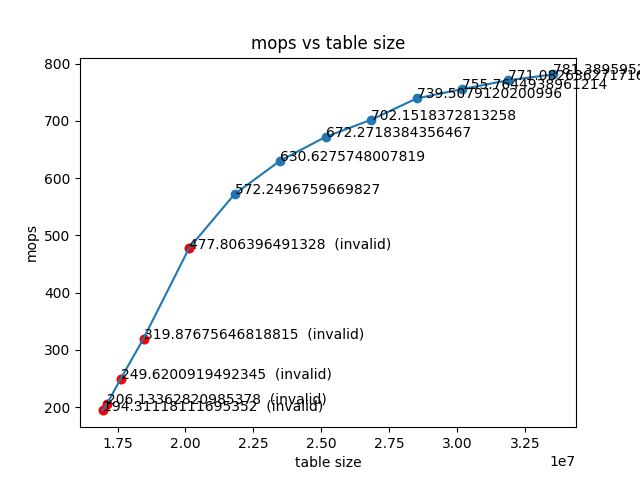
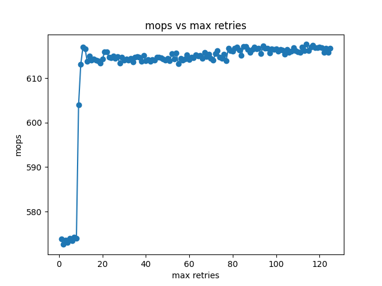
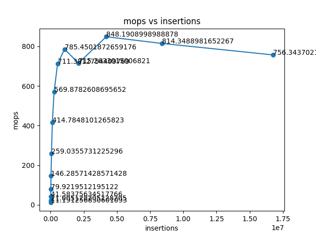
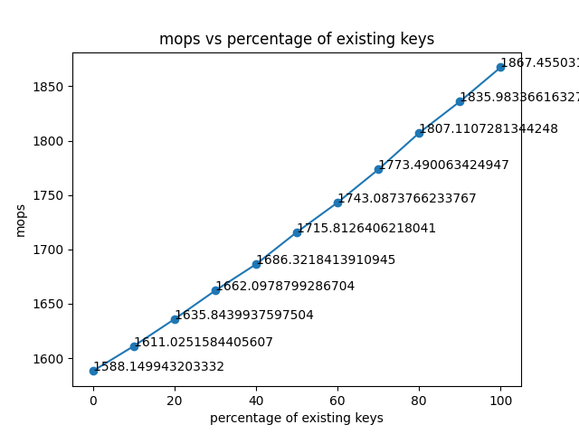

## Overview of Cuckoo Hashing

Cuckoo hashing is named after a type of bird which lays its eggs in other birds’ nests, and whose chicks push out the other eggs from the nest after they hatch. Cuckoo hashing uses an array of size _n_, allowing up to _n_ items to be stored in the hash table. For simplicity, we only consider storing keys in the hash table and ignore any associated data.

We first describe the insert operation, which is the most complex. Each key _k_ can be stored into one of _t_ > 1 locations in the table, where _t_ is generally a small number such as 2. These locations are given by _h1(k)_, _h2(k)_, ..., _ht(k)_, where _h1_, _h2_, ..., _ht_ are fixed hash functions. To insert _k_, we try to store it in location _h1(k)_. If _h1(k)_ was previously empty, then we are done. However, if there was a key _k1_ previously stored in _h1(k)_, then we need to evict _k1_ and store it elsewhere in the table. In particular, suppose _h1(k) = hi(k1)_; that is, location _h1(k)_ is the _i'th_ location where _k1_ can be stored. Then we store _k1_ in the next possible location _hi+1(k1)_; if _i + 1 > t_, we wrap around and store _k1_ at location _h1(k1)_. Then, similar to before, we check for the new location for _k1_ was previously empty. If so, we are done. Otherwise, if the location was previously occupied by a key _k2_, and if this location is the _i2'th_ possible location for _k2_, i.e. _hi2(k2)_, we evict _k2_ and store it at its next possible location _hi2+1(k2)_ (wrapping around if necessary). Storing _k2_ may cause another eviction, requiring us to repeat the previous procedure.

Eventually, the insertion operation either terminates with an insertion into an empty location, or leads to a long chain of evictions. Worse still, the chain can sometimes cycle back on itself and cause an infinite loop. In order to avoid overly long eviction chains, we place an upper bound _M_ on _(log n)_ on the length of a chain. If an insertion causes more than _M_ evictions, we declare a _failure_ using the current hash functions _h1_, ..., _ht_. We then restart the insertion process by picking a new set of hash functions of _h1'_, ..., _ht'_, and trying to insert _all_ the keys using the new functions. That is, we rebuild the entire hash table using a new set of hash functions. We repeat this process until all the keys are successfully inserted using some set of hash functions. An illustration of the insertion process can be seen at the Wikipedia page [Cuckoo hashing](https://www.wikiwand.com/en/Cuckoo_hashing).


# compile

please make sure CUDA and OpenMP environment is properly set. This software is ordinary.

```
make
```

# benchmarks

The script is set. 

```
./task1
./task2
./task3
./task4
```

will execute the following tasks respectively:

1. **Insertsion Test** Create a hash table of size 2^25 in GPU global memory, where each table entry stores a 32-bit integer. Insert a set of 2^s random integer keys into the hash table, for s = 10,11, ... 24.

2. **Lookup Test** Insert a set _S_ of 2^24 random keys into a hash table of size 2^25, then perform lookups for the following sets of keys _S0_, ..., _S10_. Each set _Si_ should contain 2^24 keys, where _(100 - 10i)_ percent of the keys are randomly chosen from _S_, and the remainder are random 32-bit keys. For example, _S0_ should contain only random keys from _S_, while _S5_ should 50% random keys from _S_, and 50% completely random keys.

3. **Capacity Test**  Fix a set of _n_ = 2^24 random keys, and measure the time to insert the keys into hash tables of sizes 1.1n, 1.2n, ..., 2n. Also, measure the insertion times for hash tables of sizes 1.01n, 1.02n and 1.05n. Terminate the experiment if it takes too long and report the time used.

4. **Eviction Test** Using _n_ = 2^24 random keys and a hash table of size 1.4n, experiment with different bounds on the maximum length of an eviction chain before restarting. Which bound gives the best running time for constructing the hash table? Note however you are not required to find the optimal bound.


# result


I run the benchmark on OS: Ubuntu 20.04.4 LTS x8664, with Intel Xeon Gold 6342 (96t/48c) @ 3.500GHz CPU. I ran my benchmark on NVIDIA RTX 3090.

      